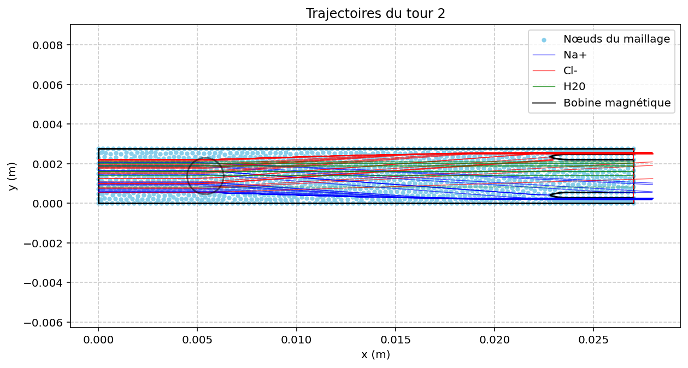
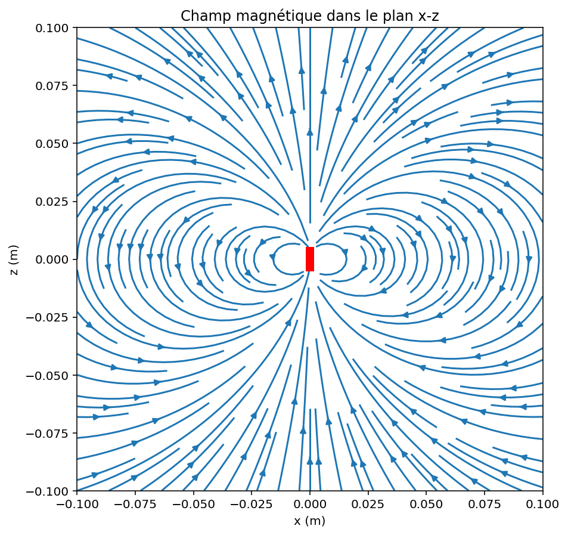
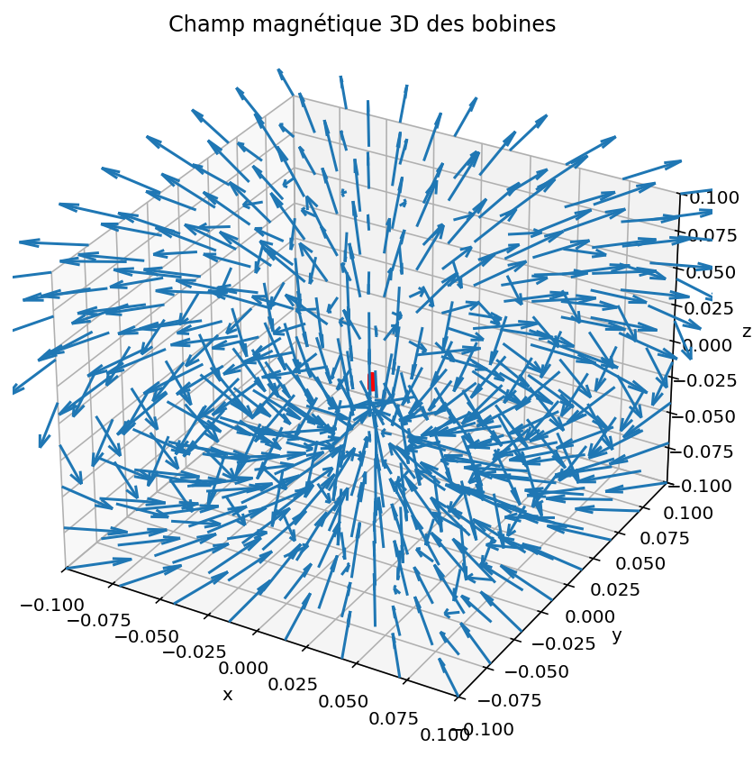

# Projet Dessalinisateur sans consommables – Séparation électromagnétique des ions

Réaliser la simulation et l'optimisation de la trajectoire des particules de Na+ et Cl- soumisent à l'intérieur du tube à un champ magnétique généré par une bobine située à une position stratégique.


# Auteurs

- DOHEMETO Bonaventure
- DRIEUX Audrey
- FISK Thomas

---



# Dessalinisateur électromagnétique – Simulation et optimisation

Ce dépôt contient l'ensemble des codes permettant de simuler un **dessalinisateur sans consommables** qui sépare les ions Na⁺ et Cl⁻ par un champ magnétique.  
Le projet combine :

- **FreeFem++** – génération de maillages 2D/3D et résolution de l'écoulement de Stokes
- **Python** – calcul exact du champ magnétique (intégrales elliptiques), suivi des particules chargées (force de Lorentz) et optimisation des paramètres de la bobine

Les particules sont recirculées plusieurs fois (multi‑tours) pour améliorer la séparation. Une **optimisation par grille** (grid search) est effectuée pour maximiser le taux de capture des ions.

## Contenu du projet

- `Maillage2D.edp` – Génération du maillage 2D du tube (FreeFem)
- `SolveStokes.edp` – Résolution de l'écoulement de Stokes (FreeFem)
- `Maillage3D.edp` – Extrusion 3D du maillage (FreeFem)
- `Champ2D3D.py` – Visualisation du champ magnétique d’une bobine multi‑spires
- `SolveParticule.py` – Simulation multi‑tours **avant optimisation**
- `SolveParticule2.py` – Simulation multi‑tours **avec paramètres optimisés**
- `SolveParticuleOptimiser.py` – Optimisation des paramètres de la bobine (grid search parallélisé)
- `nodes.txt`, `ux.txt`, `uy.txt`, `p.txt` – Données exportées par FreeFem (vitesse, pression)
- `Rapport.pdf` – Rapport complet du projet (français)
- `domaine.png` – Schéma annoté de la géométrie

<span style="color:red;">🔴🔴🔴 **IMPORTANT** 🔴🔴🔴</span> – Avant de lancer l’optimisation, vérifiez que les fichiers FreeFem (`nodes.txt`, `ux.txt`, `uy.txt`) sont bien générés. Le script `SolveParticuleOptimiser.py` utilise le parallélisme (`ProcessPoolExecutor`) – adaptez le nombre de workers à votre machine.

---



## Description du workflow

### 1. Géométrie et maillage (FreeFem++)

Le domaine 2D représente une coupe longitudinale du tube. Les paramètres géométriques sont :

- `L` : longueur totale (m)
- `D` : hauteur totale (m)
- `lwall = D/10` : épaisseur des murs
- `Lwall = L/8` : longueur de la partie terminale
- `eta = D/10` : épaisseur des pointes
- `Rtip = eta/2` : rayon des extrémités
- `delta = 6*Rtip` : profondeur des pointes
- `xmur = L - Lwall` : abscisse de début des pointes
- `n = 1.5` : paramètre de forme des superellipses

Le maillage est adapté (raffinement local) et exporté au format `.mesh`.

### 2. Écoulement de Stokes (FreeFem++)

On résout les équations de Stokes stationnaires :

\[
\begin{cases}
-\nu \Delta \mathbf{u} + \nabla p = 0 \\
\nabla \cdot \mathbf{u} = 0
\end{cases}
\]

Conditions aux limites :
- **Parois fixes** : adhérence (\(\mathbf{u}=0\))
- **Entrée** : pression imposée \(p = P_{in}\), condition de Neumann sur la vitesse
- **Sortie** : pression imposée \(p = P_{out}\), \(\partial \mathbf{u}/\partial n = 0\)

Les champs de vitesse `ux` et `uy` sont interpolés ensuite en Python par un interpolateur **Clough‑Tocher**.

### 3. Champ magnétique (Python – exact)

Une bobine de `N` spires circulaires coaxiales (rayon `R_coil`, espacement `spacing`) crée un champ magnétique **stationnaire**.  
Le champ d’une spire est donné par les intégrales elliptiques complètes :

\[
\begin{aligned}
B_\rho(\rho,z) &= \frac{\mu_0 I}{2\pi} \frac{z}{\rho\sqrt{(\rho+R)^2+z^2}} \left[ \frac{R^2+\rho^2+z^2}{(\rho-R)^2+z^2} E(k) - K(k) \right], \\
B_z(\rho,z)  &= \frac{\mu_0 I}{2\pi} \frac{1}{\sqrt{(\rho+R)^2+z^2}} \left[ \frac{R^2-\rho^2-z^2}{(\rho-R)^2+z^2} E(k) + K(k) \right],
\end{aligned}
\]

avec \(k^2 = \frac{4R\rho}{(\rho+R)^2+z^2}\).  
Le champ total est la somme des contributions de chaque spire.

### 4. Mouvement des particules (Python – schéma de Heun)

Chaque particule (Na⁺, Cl⁻, H₂O) est soumise à la **force de Lorentz** :

\[
m\frac{d\mathbf{v}}{dt} = q\,\mathbf{v}\times\mathbf{B}
\]

La vitesse du fluide \(\mathbf{u}_f\) est ajoutée à la vitesse propre de la particule :

\[
\frac{d\mathbf{r}}{dt} = \mathbf{v} + \mathbf{u}_f(\mathbf{r})
\]

Le système est intégré par un **schéma de Heun** (prédiction‑correction) avec un pas de temps \(\Delta t = 10^{-3}\) s.

**Gestion des obstacles :**
- Amortissement vertical près des parois horizontales (coefficient dépendant du signe de la charge)
- Projection sur les pointes (superellipses) avec condition d’adhérence (vitesse nulle)
- Collisions avec les murs internes verticaux (annulation de la vitesse verticale)

### 5. Simulation multi‑tours et réinjection

- **Sortie par les zones latérales** (bas : \(y \le lwall\) ; haut : \(y \ge D-lwall\)) : la particule est capturée (fin).
- **Sortie par la zone médiane** (\(lwall+\eta < y < D-lwall-\eta\)) : la particule est **réinjectée** à l’entrée (\(x=0\)) avec la même hauteur \(y\) pour un tour supplémentaire.
- On fixe un nombre maximal de tours (par défaut 2).

### 6. Optimisation des paramètres de la bobine (grid search)

On cherche à maximiser le **score de séparation** :

\[
\text{Score} = \#(\text{Cl}^- \text{ en zone haute}) + \#(\text{Na}^+ \text{ en zone basse}) - \#(\text{particules en zone milieu})
\]

Les paramètres explorés sont :

| Paramètre | Valeurs testées |
|-----------|------------------|
| \(N\) (nombre de spires) | 30, 40, 50 |
| \(I\) (intensité, A) | 0.005, 0.001, 0.01, 0.05 |
| \(R_{\text{coil}}\) (m) | 0.0001, 0.0005, 0.002 |
| `spacing` (m) | 0.0005, 0.0025, 0.001 |
| \(z_{\text{coil}}\) (m) | 0.01, 0.0, 0.005 |
| \(L\) (longueur du tube, m) | 0.020, 0.027, 0.035, 0.045 |

Soit **1296 combinaisons**.  
L’évaluation est parallélisée sur tous les cœurs disponibles (module `concurrent.futures`). Chaque combinaison est testée en **mode rapide** (10 particules par espèce, 1 tour). Les résultats sont sauvegardés dans `resultats_optimisation.csv`.

---

## 🖥️ Configuration matérielle utilisée

| Caractéristique | Détail |
|-----------------|--------|
| **Processeur** | AMD Ryzen 7 7730U with Radeon Graphics |
| **Architecture** | x86_64 (64-bit) |
| **Cœurs / Threads** | 8 cœurs / 16 threads |
| **Fréquence CPU** | 410 MHz – 2000 MHz (boost activé) |
| **Cache** | L1 : 256 KiB, L2 : 4 MiB, L3 : 16 MiB |
| **RAM** | 16 Go |
| **Système d’exploitation** | Linux (Ubuntu 22.04) |

---

## Exécution pas à pas

1. **Générer le maillage 2D**  
   ```bash
   FreeFem++ Maillage2D.edp
